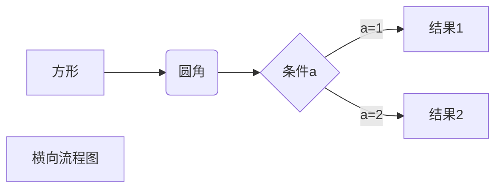
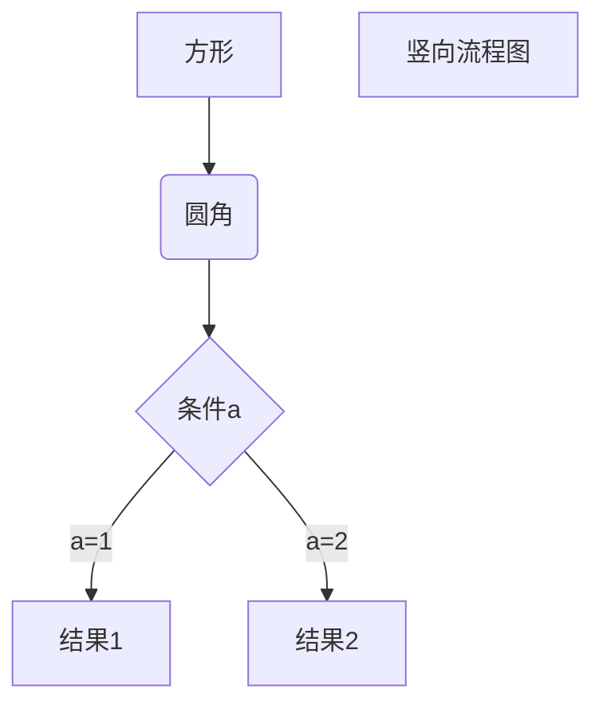

# 汪荣顶的 MarkDown 学习笔记

## 二级标题

### 三级标题

#### 四级标题

##### 五级标题

###### 六级标题

---

_斜体_
**粗体**
**_粗斜体_**
~~删除线~~
<u>删除线</u>
<i>删除线</i>
<b>删除线</b>
<a href="#">删除线</a>
使用 <kbd>Ctrl</kbd>+<kbd>Alt</kbd>+<kbd>Del</kbd> 重启电脑
<em>qwe</em> <sup>qwe</sup> <sub>asdf<sub>
<br>
<em>qwe</em> <sup>qwe</sup> <sub>asdf<sub>

---

[插入链接](http://www.baidu.com "这是一个title")
<http://www.baidu.com>
[插入链接 2][插入的链接]

[插入的链接]: "http://www.baidu.com" "baidu"

---


---

脚注[^er]
脚注[^er2]
脚注[^er3]

[^er]: 我是一个小脚注
[^er2]: 我是一个小脚注 2
[^er3]: 我是一个小脚注 3

---

> 引用段落
>
> > 嵌套
> >
> > > 我再嵌

---

`代码块`

    //代码块2
    一个 tab 或者四个空格也是代码块~
    let RondDing="suaige"
    function xx(){
        console.log(RondDing);
    }

```JavaScript
//代码块3
//可以指定一门语言
    let RondDing="suaige"
    function xx(){
        console.log(RondDing);
    }
    xx();
```

---

-   无序列表
-   无序列表

*   无序列表 2
*   无序列表 2

1. 有序列表
2. 有序列表

-   多级列表
    -   22
        -   22
            -   22

---

|   表格   | Colum1 | Colum2 |
| :------: | :----- | -----: |
| 居中对齐 | 左对齐 | 右对齐 |
|    1     | 2      |      3 |
|    1     | 2      |      3 |

<table>
    <thead>
        <th>qwe</th>
        <th>qwe</th>
        <th>qwe</th>
    </thead>
    <tr>
        <td>Foo</td>
        <td>Foo</td>
        <td>Foo</td>
    </tr>
    <tr>
        <td>Foo</td>
        <td>Foo</td>
        <td>Foo</td>
    </tr>
</table>
---

:( :| :) :/

---

特殊符号:
&copy;
AT&T
AT&amp;T

<div style="text-align:left">

&emsp;我是中文我是中文,缩进一个字符

&ensp;我是中文我是中文,缩进半个字符

&nbsp;我是中文我是中文,缩进四分之一字符

我是中文我是中文

</div>

<div style="text-align:center;color:green;font-size:22px">

居中就完事~

</div>

---





```sequence
对象A->对象B: 对象B你好吗?（请求）
Note right of 对象B: 对象B的描述
Note left of 对象A: 对象A的描述(提示)
对象B-->对象A: 我很好(响应)
对象A->对象B: 你真的好吗？
```
